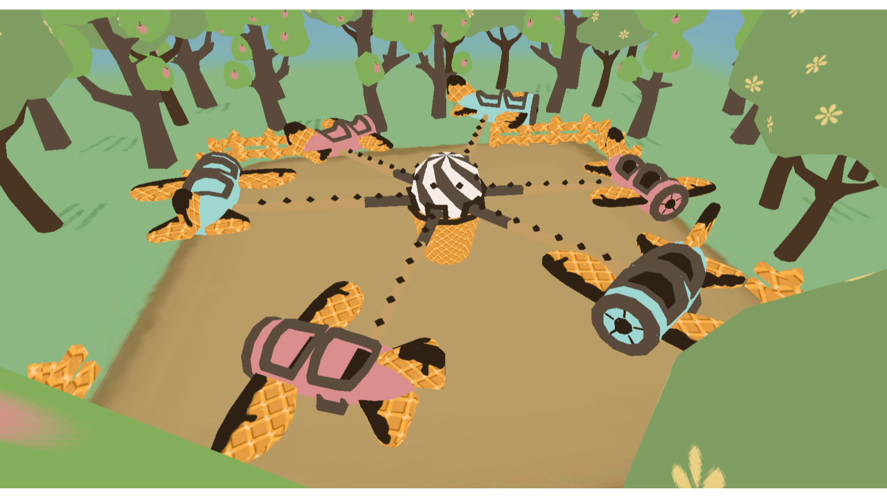

# Interactive 3D Airplane Carousel (OpenGL Project)

This project is an **interactive 3D scene** implemented in C++ with **OpenGL (GLUT)**.  
It features hierarchical modeling, lighting, texture mapping, and multiple interaction modes.

## How to Run

1. Go to the [Releases](../../releases) page.
2. Download **Carousel_Release.zip**.
3. Extract the zip file.
4. Double-click **Carousel.exe** (make sure the `textures/` folder is in the same directory).

## Controls
- `w/s/a/d` → look/rotate  
- `q/e` → zoom in/out (third-person)  
- `f` → switch to first-person  
- `t` → switch to third-person  
- `l` → toggle lighting  
- `p` → change swing pattern  
- `esc` → exit program  
- **Right-click menu**: quick access to view, lighting, swing pattern, and quit  

## Demo Screenshots & GIFs
Third-person view:  

First-person view:  

Lighting off (no shading):  

## Demo Video
Bilibili link: https://www.bilibili.com/video/BV1wHRWYEENA/?share_source=copy_web&vd_source=59e2f14ef51f5a275d8f835fdf1d3b22
